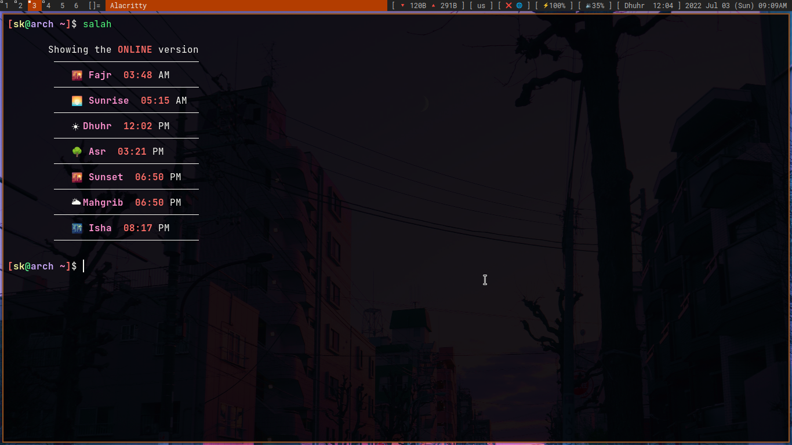

# Salah (cli)
## This is a small script to get the time of Salah/Namaj in the Terminal

#### it also keeps a archived version but if internet is available it gets the online one

#### To install use this command
#### Must Install "jq" (it should be in ur repo) this this comman with your pkg mannager ``` sudo pacman -S jq ```
```bash
sudo curl "https://raw.githubusercontent.com/sakibulxyz/salah/main/salah" -o /usr/bin/salah && sudo chmod +x /usr/bin/salah
```

##### To add locatin just run it and give the city location and done...
##### if the location was incorrect then just run ```salah -c``` and change the names
